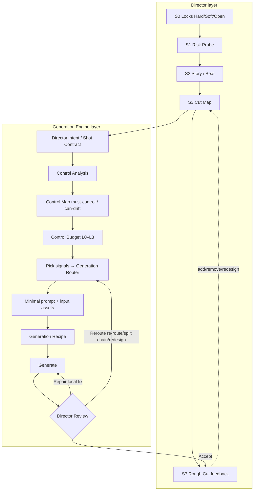

# Cinematic Pioneer Story Director

<p align="center">
<a href="README.md">简体中文</a> · <b>English</b>
</p>

**An AI short-film / commercial directing Skill for solo creators.**
It doesn't teach you "how to turn a shot into a prompt." It decides for you: **which control signals this shot needs and which generation path gets the picture at the lowest trial-and-error cost.**

> The prompt is the last mile, not the center.

First open-source release: **v1.0.0 — Director + Generation Router architecture**

---

## Why it exists

When making short films with AI, the usual failure isn't "the words aren't fancy enough":

- Inconsistent character → add appearance words; wrong camera move → add camera words; action, composition and space all wrong → add more words. You end up with a 500-word prompt whose parts fight each other and control nothing.
- You fill every second and every lighting/color layer on paper up front, locking the exploration phase to a storyboard that collapses the moment real footage appears.
- You re-roll the same shot endlessly, burning credits, without ever asking "is this a prompt problem, or the wrong generation route?"
- You re-generate for background details the audience will never see, while the one crucial frontal-line shot gets no backup take.

This Skill's answer: **identity, composition, camera move, space and continuity can be locked by deterministic signals — don't hand them to adjectives.** Run control analysis first, choose the inputs, and let the prompt handle only what it's good at (intent, mood, performance tone).

---

## Quickstart (5 steps to your first shot)

> Every step has a copy-and-fill template in [`templates/`](templates/); to look up how a single feature is written, search [`examples/feature-cookbook.md`](examples/feature-cookbook.md).

**Step 0 (first collaboration — no jargon needed)**: just send your idea. I will first ① play back in plain language what I understood, ② lay out the work plan for *your* film (marking where you supply assets or make a call and what you get next), and ③ ask at most 3–5 multiple-choice questions — only on forks that would cause rework if guessed wrong — each with a recommended default; everything else I assume for you and you can overturn anytime. Technical terms are reframed as "what effect do you want," and I flag up front which effects current AI does unreliably and how I'll route around them. See `solo-workflow.md` §0, card C0, and the intake card at the top of [`templates/01`](templates/01-project-locks-and-probe.md).

1. **Lock + probe**: copy [`templates/01`](templates/01-project-locks-and-probe.md), fill the Hard/Soft/Open locks; pick the one hardest shot ("if this fails the film fails" — usually the heaviest frontal line) and run one cheap Probe to verify the platform's lip-sync / camera ability before writing the whole film.
2. **Assets before video**: generate character costume stills + establishing scene images with an image tool (images are far cheaper than video), unify framing and light direction, log them in the asset ledger.
3. **Build the Cut Map**: copy [`templates/02`](templates/02-cut-map.md); mark only shot id, narrative job, must-have/candidate, lip tier (A+/A/B/C), control budget (L0–L3), preferred route, start-frame asset — **no prompts here**.
4. **Work one shot**: copy [`templates/03`](templates/03-shot-contract-control-map.md) and follow Control Analysis → Control Map → Budget → pick signals → Router → minimal prompt; archive the final version into [`templates/04`](templates/04-generation-recipe.yaml).
5. **Generate + review + rough cut**: handle results with Accept / Repair / Reroute (after 3 consecutive failed attempts with the same approach, circuit-break — don't burn credits), log in [`templates/05`](templates/05-production-log-and-assets.md); as soon as a batch is usable, rough-cut and let it drive added/removed/redesigned shots.

One-line memory: **decide what to control and what controls it — write the prompt last.**

---

## Two-layer architecture



- **Director layer**: a jumpable `S0–S8` state machine for narrative and pacing decisions; supports story-first, visual-first, asset-first and edit-while-generating.
- **Generation Engine layer**: engineers "producing one shot" into a control pipeline; the prompt sits at the end.

---

## Core concepts

> **No jargon to memorize**: just share your idea — the Skill communicates in plain language and puts technical names in parentheses. The most frequent terms are below; the full bilingual mapping (workflow, shots, lip-sync, PBR materials, QC/cost) is in [`references/plain-language-glossary.md`](references/plain-language-glossary.md) (a Chinese-first plain-language glossary; technical English terms are shown alongside).

| In plain language | Technical name |
|---|---|
| Kickoff alignment; things are "fixed / negotiable / free to experiment" | S0 intake; Hard / Soft / Open locks |
| Test one shot first to see if the AI can do it | Probe |
| Shot blueprint (list shots first, not how to shoot) | Cut Map |
| Per-shot instruction sheet | Shot Contract |
| Control-point list: must lock / let drift | Control Map: MUST CONTROL / CAN DRIFT |
| How much control to invest (minimal → full) | Control Budget L0–L3 |
| Things that "pin" the picture (refs/start frame/proxy…) | Control Signals |
| Animate from an image / from text / rework a video | I2V / T2V / V2V |
| Motion stand-in (gray-box, rough phone clip, stick figure) | Motion / Spatial Proxy |
| Pick which generation path | Generation Router |
| Per-shot recipe archive (portable, disclosable) | Generation Recipe |
| Accept / patch locally / change route | Accept / Repair / Reroute |
| Assemble a rough cut early to drive add/remove | Rough Cut |
| Must this line be spoken clearly face-on | Lip tier A+ / A / B / C |
| Make metal look like metal, skin like skin | PBR materials / SSS subsurface scattering |

### Director layer

- **Hard / Soft / Open locks**: fixed lines/endings and safety red lines are Hard (never change on your own); shot count, framing, camera moves and batching are Soft (can be overturned by footage evidence, and logged); openings, transitions and experiment shots are Open (explore freely).
- **Probe**: before full planning, cheaply verify 1–3 high-risk points that would sink the film (heaviest lip-sync, hardest continuity, unverified ability); don't expand the full plan until they pass.
- **Cut Map**: a rough-cut blueprint marking only shots, narrative jobs, must/candidate, control budget, route and start frame — **not full prompts**.
- **Rough-cut first**: rough-cut as soon as usable footage exists; let real pacing drive added, removed and redesigned shots instead of maintaining a paper plan that no longer holds.

### Generation Engine layer

- **Control Analysis**: first decide which dimension is hardest — identity / composition / performance / camera / spatial / transition / transformation.
- **Control Map**:
  - `MUST CONTROL`: elements whose drift ruins the shot, rated HIGH / MEDIUM / LOW; **every HIGH item must be backed by a deterministic signal, not just a prompt**;
  - `CAN DRIFT`: an explicit list you let the AI vary and never re-roll for.
- **Control Signals registry**: character/scene/costume/prop references, start frame, end frame, start+end pair, video reference/V2V, motion reference, Pose/Depth/Edge structural control, Mask, audio, previous shot's tail frame, motion/spatial proxy, and more. **The registry is open — a new capability is just one new row.**
- **Control Budget L0–L3**: rated by narrative importance, identity sensitivity, motion complexity and continuity sensitivity; caps how many signals you invest —
  `L0` prompt only (establishing/bypass) · `L1` prompt + 1 reference · `L2` multiple references + controlled start frame (lead shots / frontal lines) · `L3` full references + start/end frames + motion proxy + iterative repair (climaxes / complex camera moves / strict joins).
- **Motion / Spatial Proxy**: gray-box (white model), engine blockmesh, 3D camera path, rough AI video, real phone footage, stick-figure animation, pose sequences — **anything providing time + space + motion is a control source.** The methodology only knows the abstraction "proxy"; it isn't tied to any software.
- **Generation Router**: T2V / I2V start-frame / start+end frame / multi-image / composite start frame / V2V / proxy-guided I2V / structural control / audio-driven / Mask local repair / chain split / audio-video separate tracks / pure post-production.
- **Generation Recipe**: each shot stores its full recipe (intent, control map, budget, route, every input asset version, signals, minimal prompt, audio, model params, selected take, failure history) — reproducible, learnable, transferable across models, and evidence for AI disclosure.
- **Director Review, three branches**:
  - **Accept** → rough cut;
  - **Repair** → fix locally with Mask / a short V2V; never re-generate the whole clip for one local flaw;
  - **Reroute** → change signals/method or **split the control chain** (e.g. ① stable person + simple camera → ② camera transform → ③ local face repair); if it stays uneconomical, return to the Cut Map and redesign the shot. **A fourth attempt that just edits the prompt is forbidden.**

---

## Features

### Directing & story
- Story / theme / subtext / character goals and power-relation analysis; faithful storyboarding of existing scripts (lines kept verbatim), or fleshing a one-line premise into characters, conflict and dialogue within the granted scope.
- Scene→Beat→Shot→Micro-beat breakdown; duration estimated from action, line reading, information legibility and meaningful pauses — never evenly sliced seconds.
- Anti-cliché innovation, cross-domain recombination, element-wise multi-style fusion, a film-wide "form bible" and evolving visual motifs.

### Shot generation control (core)
- **Seven-dimension control analysis**: identity / composition / performance / camera / spatial / transition / transformation.
- **Control Map**: MUST CONTROL ratings (HIGH must have a deterministic fallback) + explicit CAN DRIFT.
- **Control signal registry**: character/costume/scene/prop references, composition stills, start/end frames, start+end pairs, video reference/V2V, motion reference, motion/spatial proxy, Pose/Depth/Edge, Mask, multi-image combos, audio, previous tail frame, seed/version.
- **Control Budget L0–L3** caps the signals invested per shot.
- **Motion/spatial proxy**: gray-box, engine blockmesh, 3D camera path, rough AI video, phone footage, stick figures, pose sequences — model-agnostic.
- **Generation Router**: T2V, I2V, start+end frames, multi-image, composite start frame, V2V, proxy-guided I2V, structural control, audio-driven, Mask repair, chain split, separate audio/video tracks, pure post.
- "Take control out of the prompt" load-shedding map + minimal effective prompt; **Generation Recipe** archival; **Accept / Repair / Reroute** review and control-chain splitting.

### Action / fight scenes & 3A materials
- **Action/fight specialty**: identity is downgraded while motion/spatial/transformation are upgraded; lock blocking, weapon paths and camera recoil with a motion/spatial proxy; generate each camera angle separately and cut on action phases — a single move happens only once in the final timeline; contact points get dedicated insert shots.
- **Six elements of impact**: wind-up slow → strike fast → recover buffer; force transmitted level by level; impact deformation; impact chain reaction; momentum continuity; camera hit feedback (recoil + hit-stop). Effects follow the lifecycle cause → omen → trigger → peak → decay → residue and obey material sources (no fireballs without an enchantment).
- **3A / PBR materials**: PBR physical materials, GI global illumination, AO ambient occlusion, SSR, ray tracing; skin SSS subsurface scattering, narrow specular edge on blades, weave/leather texture, emissive energy; materials are locked at the costume/prop still stage, while the video prompt only writes state changes (force, wear, dust); detail is scaled by shot size.

### Intake & creation modes (beginner-friendly)
- **Opening Intake**: given one idea, first **play back understanding → lay out this film's work plan → ask in plain language only about forks that would cause rework** (≤3–5 multiple-choice questions, each with a recommended default); everything else gets overridable assumptions. Jargon is reframed as "what effect do you want" and explained on first use — decisions are never dumped on a non-expert.
- **Plain-language throughout (beginner-friendly)**: ships a [plain-language glossary](references/plain-language-glossary.md) giving every term (workflow, three locks, shot blueprint/instruction sheet/control-point list, L0–L3, I2V, motion proxy, PBR) a plain name plus a one-line explanation; steps, templates and progress you see default to "plain name (technical name)," while only internal archives keep technical fields.
- **Jumpable S0–S8 state machine**; story-first, visual-first, asset-first, edit-while-generating.
- **Hard/Soft/Open locks**; high-risk **Probes** (verify 1–3 show-stoppers before planning).
- **Cut Map** blueprint (must/candidate); early **Rough Cut** driving added/removed/redesigned shots from real footage.

### Camera / light / sound / performance craft
- Shot size, focal length, depth of field, composition, camera height, and camera moves **with a narrative reason**.
- Lighting narrative chain, element-level VFX lifecycle, primary/secondary color and cross-shot matching (describe the on-screen result, don't fabricate software operations).
- Sound design, ambient bed, on/off-screen sources, J-cut/L-cut, silence; line volume/pitch/pace/breath/pauses.
- Observable performance (shoulders/back, hands, eyes, Adam's apple, breath — not abstract emotion labels).
- Multi-camera functions, event cut points, action phases, the 180° axis; per-shot complexity grading and shot splitting.

### Continuity & consistency
- Film-wide state ledger: end-state inheritance, axis, props/costume/light-color/sound-source/weapon-hand continuity across shots.
- Start/end-frame visual anchors, face-preserving batching by character and scene, costume-still and scene-image asset system.

### AI platform production & sound
- Platform ability verified by testing (no hard-coded credits, durations or parameters — always use current measurements).
- **Embedded-line vs separate-audio decision tree** (prefer embedded when budget is limited).
- Line format: tone/pace/emotion placed first; punctuation carries rhythm (`——` interruption, `……` hesitation, `？` rhetorical question); overlap/interruption marked.
- **Shot-level lip tiers A+/A/B/C**; all readable Chinese UI, vote counts, signs and subtitles are composited in post to prevent garbled text.
- Chinese negative-word library and Chinese director-sentence skeletons; still-image prompts for photoreal portraits / 3A / materials / lighting.

### Cost, quality & review
- Lightweight generation log; first-pass usable rate, average re-rolls, defect Pareto, cost per usable second.
- **Defect D1–D10 countermeasures**, per-shot circuit breaker and two-/three-attempt rules.
- Shot-type → model routing, a 5–6 shot representative benchmark and a regression set for model upgrades.
- Asset version-lock ledger, personal approval gate, lightweight audience blind test, AI disclosure.

### Delivery & QC
- Staged outputs: lock list / Probe result / Cut Map / Shot Contract + Control Map / Generation Recipe / Rough Cut / final retrospective.
- G0–G6 gated self-check (including G6, the AI-generation checklist: identity/limbs/lip-sync/camera/text/continuity/light-color/load/cost/platform truthfulness).

---

## What a shot looks like

Not `SH_023 → "generate a cinematic video…"`, but first:

```
SHOT: SH_023
DIRECTOR INTENT: panicked → sudden hesitation; her first thought of fleeing; key moment = looking back at the doorway
MUST CONTROL: identity HIGH / costume HIGH / turn action HIGH / camera pull-back HIGH / space MEDIUM / rain MEDIUM
CAN DRIFT:   raindrop shapes, passersby, background props, hair detail, sign detail
CONTROL BUDGET: L3
STRATEGY: character ref + environment still + camera-motion proxy (gray-box) → proxy-guided I2V
```

With the camera path handed to the gray-box and identity to the reference, the prompt can stay short:

> She hesitates for a fraction of a second, then turns toward the doorway. Restrained performance, subtle breathing, rain catching the fluorescent light, natural cinematic motion.

### Examples & templates (three granularities)

**① Feature cookbook ("how do I write X?")** — [`examples/feature-cookbook.md`](examples/feature-cookbook.md)
Every feature gets one copy-ready minimal example card (51 cards) across 8 zones: A directing/story · B generation engine · C intake & process modes · D camera/light/sound/performance·action·PBR materials · E continuity · F platform & sound · G cost/quality/review · H stills & other formats.

**② End-to-end walkthroughs ("how do shots/the film fit together?")** — [`examples/director-examples.md`](examples/director-examples.md), built around a livestreamed public-trial short:

1. **Full walkthrough of a frontal-line long take** — Shot Contract, control analysis, Control Map, L3 budget, signal assignment, Router, minimal prompt, Generation Recipe (with v01–v05 failure history) and Director Review;
2. **L0 / L2 / L3 budget comparison** — how many signals, how long a prompt, and what to do on failure for a bypass wide shot, a short frontal line, and a climactic long take;
3. **Reroute chain split** — when identity and a 180° orbit fight each other, split into "secure person → add camera move → repair face," and when to redesign in the Cut Map;
4. **Director layer in practice** — a Probe for multi-person overlap, a Cut Map fragment, and rough-cut add/remove/material-driven beats;
5. **Sound & lip tiers** — embedded writing for A+/A/B/C lines, interruption/overlap marks, off-screen system voice and the gunshot;
6. **Migrating to other subjects** — a rainy convenience store, a dialogue-free MV/commercial, an action chase, and a pure still using the same control method;
7. **Action/fight special** — a three-person duel driven by motion/spatial proxies, multi-camera chained generation, contact-point insert shots, the six impact elements and PBR material locking (with a full contact-shot walkthrough and failure history).

**③ Copy-ready blank templates (just fill in)** — [`templates/`](templates/)

| Template | Purpose | Stage |
|---|---|---|
| `01-project-locks-and-probe.md` | Three-lock list + risk probe record | S0–S1 |
| `02-cut-map.md` | Rough-cut blueprint (must/candidate, lip tier, budget, route) | S3 |
| `03-shot-contract-control-map.md` | Per-shot worksheet (contract + analysis + map + budget + signals + prompt + acceptance) | S4–S5 |
| `04-generation-recipe.yaml` | Full shot recipe (reproducible / disclosable record) | S5–S6 |
| `05-production-log-and-assets.md` | Generation log + defect codes D1–D10 + asset ledger + model routing | S6–S8 |

---

## Directory structure

```
cinematic-pioneer-story-director/
├── SKILL.md                              # Entry: two-layer architecture & state machine
├── README.md                             # Chinese readme
├── README.en.md                          # English readme
├── LICENSE                               # MIT License
├── references/
│   ├── plain-language-glossary.md        # ★ Plain-language glossary: every term in simple words (read first)
│   ├── generation-engine.md              # ★ Generation engine (signals/control map/budget/router/recipe/review)
│   ├── solo-workflow.md                  # Director layer: state machine/locks/probes/Cut Map/rough cut
│   ├── ai-video-platform-production.md   # Platform production: reference assets, embedded lines, lip tiers, batching, Chinese UI in post
│   ├── ai-production-measurement.md      # Logs, defects D1–D10, circuit breakers, shot-type routing, version ledger, AI disclosure
│   ├── story-and-performance.md          # Story reading, task routing, director intent
│   ├── crew-and-performance.md           # Observable performance, craft perspectives
│   ├── camera-lighting-color.md          # Composition, lighting/art, color grading
│   ├── sound-timing-editing.md           # Sound design, Scene→Beat→Shot timing, multi-camera & editing
│   ├── production-continuity.md          # Spatiotemporal continuity, axis/end-state, action specialty, complexity
│   ├── innovation-engine.md              # Anti-cliché & cross-domain innovation
│   ├── film-output-checklist.md          # Film form bible, delivery spec, self-check
│   ├── toolbox-cinematography.md         # Shot size/camera move/action segmentation/duration toolbox
│   ├── toolbox-rendering-3a.md           # 3A / PBR materials, six impact elements, dynamic VFX
│   ├── toolbox-glossaries.md             # Prompt glossary, action/material words, Chinese negatives, director sentences
│   ├── toolbox-photorealism.md           # Photoreal portraits, skin (SSS) & lighting
│   ├── toolbox-quality-anchors.md        # Quality anchors
│   ├── toolbox-output-examples.md        # Output examples
│   └── toolbox-checklist.md              # Gated self-check G0–G6 (incl. AI generation G6)
├── templates/                            # Copy-and-fill templates (01–05)
│   ├── 01-project-locks-and-probe.md
│   ├── 02-cut-map.md
│   ├── 03-shot-contract-control-map.md
│   ├── 04-generation-recipe.yaml
│   └── 05-production-log-and-assets.md
└── examples/
    ├── feature-cookbook.md               # ★ Feature cookbook: 51 copy-ready minimal cards (incl. C0 intake)
    └── director-examples.md              # End-to-end walkthroughs (7, incl. a fight-scene special)
```

Craft knowledge (camera/light/performance/sound/action/materials) is a tool library **loaded on demand by shot risk** — you don't read it all up front, and no fixed stack of layers is mechanically applied to every shot.

---

## "I want to…" (task map)

| I want to… | Go here |
|---|---|
| Get started the fastest | Quickstart above + fill `templates/01`–`05` in order |
| I only have a one-line idea, don't know the jargon or what to provide | Opening Intake: `solo-workflow.md` §0 + card C0 + intake card atop `templates/01` (just share the idea; I play it back, plan, and ask in plain language) |
| A specific term is unclear (S0 / Cut Map / L2 / I2V / PBR) | `plain-language-glossary.md` — plain name + one-line explanation |
| See how one specific feature is written | the matching card in `examples/feature-cookbook.md` (zones A–H) |
| See one shot start to finish | `examples/director-examples.md`, example 1 |
| Storyboard / time a script | `story-and-performance.md`, `sound-timing-editing.md` + cards A1–A3 + `templates/02` |
| Decide references / preserve faces | cards B4/F2/F3 + `generation-engine.md` §2 + `ai-video-platform-production.md` §2 |
| Nail precise camera moves / multi-person blocking | cards B5/B10 (motion/spatial proxy, chain split) |
| Do fights / chases / multi-person action | card D8 + `director-examples.md` example 7 + `toolbox-rendering-3a.md` |
| Get 3A / photoreal materials, metal & skin | card D9 + `toolbox-rendering-3a.md`, `toolbox-photorealism.md` |
| Face drift / shaky camera / bad lip-sync | cards B9/B10/G3, defects D1/D4/D3 (table B in `templates/05`) |
| Embedded lines, interruption/overlap, lip tiers | cards F4/F5/F6 + `ai-video-platform-production.md` §4–5 |
| Control credits, circuit-break, batch | cards F7/G4 + `ai-production-measurement.md` §2–4 |
| I already have footage / a rough cut | cards C1/C5 (asset-first, rough-cut feedback) + `solo-workflow.md` §11 |
| Switch model/platform without rewriting | card G1 (separate director spec from platform adapter) |
| Disclose AI use for release/festivals | card G8 + `ai-production-measurement.md` §9 (Recipe + log + ledger are the evidence) |
| Just make a poster / costume still | card H1 (still-image branch, no video engine) |

---

## Cheat sheet

**Opening 3 moves (Step 0)**: play back understanding (facts vs my assumptions) → lay out this film's plan (marking where you act) → plain-language questions (≤3–5 multiple-choice, each with a recommended default); "you decide" switches to the hands-off default path — no chained interrogation, no jargon.

**Engine 9 steps**: director intent → Shot Contract → Control Analysis → Control Map → Budget L0–L3 → pick signals → Router → minimal prompt → save Recipe → Generate → Accept/Repair/Reroute.

**Budget rating (four questions)**: narrative importance? identity sensitivity? motion complexity? continuity sensitivity?
`L0` prompt only · `L1` +1 reference · `L2` multiple references + controlled start frame · `L3` full references + start/end frames + motion proxy + iterative repair. Over budget = uneconomical design, return to the Cut Map.

**Lip tiers (per shot)**: `A+` frontal key line, generate backups · `A` frontal non-key, 1–2 takes · `B` profile/occluded/reaction, actively avoid frontal lip · `C` off-screen/crowd/silent, no lip-sync, pass what works.

**Signal choice**: identity→character ref · scene→environment ref · composition/camera→start frame · camera path→motion/spatial proxy · end-state join→end/previous-tail frame · motion规律→motion reference · pose/depth→Pose/Depth/Edge · lip/pace→audio · change one area→Mask · mood/texture/subtle emotion→Prompt.

**Router mnemonic**: identity first → I2V/multi-image; trajectory first → proxy/V2V; joins first → start+end frames; local problems first → Mask; readable text/UI always pure post-production.

**On failure**: 1st single-variable prompt edit → 2nd reduce load/split shot/lower lip tier → 3rd change route or model → still failing, redesign in the Cut Map. Hard circuit breaker: stop after **3** consecutive failures with the same approach; A+ capped at 5–6; C passes what works. Before rerouting, ask whether the failure is a **missing signal / conflicting signals / model ceiling** — never rescue a fourth time by piling on prompt words.

**Production order**: assets before video; batch the same character/scene together reusing start frames to preserve faces; do A+ shots first and make more; crowds get only 2–5 foreground actions; the climax last; leave ~half-second transition handles; all readable Chinese/numbers/signs/subtitles composited in post.

---

## Installation

**Environments supporting Agent Skills (the `SKILL.md` convention)** (e.g. Doubao, Claude, etc.):

1. Download the repo or unzip the release zip;
2. Put the whole `cinematic-pioneer-story-director/` folder in your skills directory (user- or project-level);
3. Keep the structure (`SKILL.md` at the folder root, with `references/`, `examples/`, `templates/` alongside);
4. Restart or refresh the skill list and invoke it by name: `cinematic-pioneer-story-director`.

**Without a skill loader**: use `SKILL.md` as a system/project instruction and treat `references/` as an on-demand manual — the entry file tells you which document to read for the current shot.

---

## Usage

Enter with any of:

- A full script / dialogue (kept verbatim, storyboarded scene by scene);
- A one-line premise (fleshed into characters, conflict and dialogue within scope);
- Character costume stills, scene images, reference video;
- Already-generated rough footage (asset-first; infer beats and needed shots from the picture);
- A rough cut (diagnose missing shots, redundant shots and pacing).

Outputs progress by stage: **lock list → Probe result → Cut Map → per-shot Shot Contract + Control Map → Generation Recipe → rough cut → final retrospective**.

Suited to: AI short films, trailers, commercials, dialogue scenes, ensemble pieces, action/fight scenes and experimental films; still-image tasks automatically take the image branch.

---

## Design philosophy

1. **Control over description**: what a reference, start/end frame or proxy can lock, never leave to adjective prayers.
2. **The prompt is the last mile**: it carries only intent, mood, performance tone and subtle motion that can't be signaled.
3. **Spend where the audience can see it**: Control Budget and CAN DRIFT stop you paying for invisible detail.
4. **On failure, change route, not wording**: distinguish missing signal, conflicting signals and model ceiling; redesign when needed.
5. **Footage-driven, rough-cut early**: paper completeness isn't the goal — a working film is.
6. **Separate director semantics from the platform adapter**: intent / Control Map / Recipe are model-agnostic; switching models only changes the adapter.
7. **Open and extensible**: a new model is one new row in the signal table and one in the route table — the engine frame stays.
8. **Respect creative bottom lines**: never alter fixed lines/endings; never present unverified model ability as fact; never substitute VFX, slow motion or push-in clichés for directorial judgment.
9. **Align first, speak plainly**: never assume the user knows the jargon; on receiving an idea, play it back, lay out the plan, and ask in plain language only on rework-causing forks — keep the professional judgment to yourself and hand the user the "what effect do you want" choice.

---

## Methodology evolution

The first open-source release is **v1.0.0**. Before going public the system went through three internal iterations, which explain the current two-layer structure:

| Phase | Focus |
|---|---|
| Early | Modular coverage of full directing craft (story/performance/camera/light/grade/sound/editing), Scene→Beat→Shot timing and multi-camera |
| Middle | Solo-creator oriented: jumpable state machine, three lock types, Probes, Cut Map, risk-triggered loading, minimal effective prompts, early rough cut |
| Current (v1.0.0) | Director + Generation Router: signal taxonomy, Control Map, Control Budget, motion/spatial proxy, Generation Recipe, Accept/Repair/Reroute |

Future versions ship via GitHub Releases and a CHANGELOG, following Semantic Versioning.

---

## Boundaries

- It is a **directing-decision and production-orchestration** layer; it isn't bound to and doesn't pretend to embed any specific video model. Platform ability, credits and parameters always follow current measurements.
- It doesn't click "generate" for you or call private APIs; when automation is needed, the Recipe already packages inputs and routes into an executable checklist.
- It doesn't promise zero model error: timecodes are trim-able budgets; when complex control is impossible it suggests splitting, chained generation or post-production rather than promising a one-pass result.

---

## AI compliance

More platforms and festivals require AI short-film submissions to disclose the models, versions, prompts/parameters and reference materials used. This Skill's **Generation Recipe + generation log + asset version ledger** naturally form a traceable evidence chain from which you can export an AI-use statement before delivery. Please also confirm portrait rights, voice licensing and your target platform's rules yourself.

---

## License

Released under the **[MIT License](LICENSE)**.

> When publishing your own version, replace the copyright line in `LICENSE` (`Cinematic Pioneer Story Director contributors`) with your name or GitHub ID (e.g. `Copyright (c) 2026 Your Name`).
