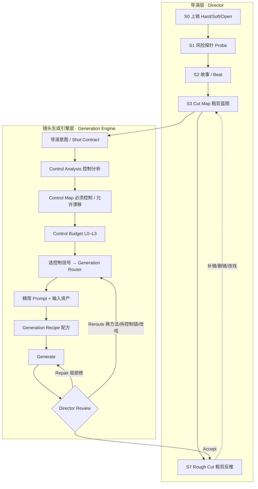

# Cinematic Pioneer Story Director

<p align="center">
<b>简体中文</b> · <a href="README.en.md">English</a>
</p>

**一个面向单人创作者的 AI 短片/广告导演 Skill（技能包）。**
它不教你"怎么把镜头写成一段提示词"，而是替你决定：**这个镜头该用什么控制信号、走什么生成路径，才能以最低试错成本拿到想要的画面。**

> The prompt is the last mile, not the center.
> 提示词是最后一公里，不是创作的中心。

首次开源版本：**v1.0.0 — Director + Generation Router 架构**

---

## 为什么需要它

用 AI 拍短片时，最常见的失败不是"词写得不够华丽"，而是：

- 人物不一致 → 往提示词里加长相描述；运镜不对 → 加运镜描述；动作、构图、空间全错 → 继续加词。最后得到一段 500 字、互相干扰、谁也控制不住的提示词。
- 一上来就把全片每一秒、每一层摄影灯光色彩写满，结果探索期被纸面分镜锁死，素材一出来发现根本不是那么回事。
- 同一个镜头无限重试烧积分，却没人判断"这到底是提示词问题，还是生成路线选错了"。
- 为观众根本看不到的背景细节反复重生，真正关键的正脸台词镜却没多给一条备选。

本 Skill 的回答是：**身份、构图、运镜、空间、衔接，这些能被确定性信号锁定的东西，不要交给形容词。** 先做控制分析，再决定用什么输入，提示词只负责它真正擅长的部分（意图、氛围、表演基调）。

---

## 快速开始（5 步走通第一个镜头）

> 所有步骤都有可复制的填空表，在 [`templates/`](templates/)；想查某个功能的写法，搜 [`examples/feature-cookbook.md`](examples/feature-cookbook.md)。

**第 0 步（第一次合作，不用懂术语）**：把你的想法发我即可。我会先 ①用大白话回显我理解的片子、②列出针对你这片的开工路线（标明哪步要你给素材/拍板、之后给你什么）、③只就"答案不同会方向性返工"的关键点问最多 3–5 个选择题并给推荐默认，其余替你做可随时推翻的假设；专业词都翻译成"想要什么效果"来问，开场还会提前告诉你哪个效果当前 AI 做不稳、打算怎么绕。详见 `solo-workflow.md` 第 0 节、菜谱 C0、[`templates/01`](templates/01-project-locks-and-probe.md) 顶部对齐卡。

1. **上锁 + 探针**：复制 [`templates/01`](templates/01-project-locks-and-probe.md)，填 Hard/Soft/Open 三类锁；挑 1 个"做不出来全片垮"的最难镜（通常是最重的一句正脸台词）做一条最便宜的 Probe，验证平台口型/运镜能力，通过前不写全片。
2. **先备资产，再开视频**：用图像工具出齐角色定妆照 + 场景 establishing 图（图像比视频便宜得多），统一景别与光向，登记到资产台账。
3. **列 Cut Map**：复制 [`templates/02`](templates/02-cut-map.md)，只标镜号、叙事任务、必须/Candidate、口型级（A+/A/B/C）、控制预算（L0–L3）、首选路线、首帧资产——**这一步不写提示词**。
4. **走通一个镜头**：复制 [`templates/03`](templates/03-shot-contract-control-map.md)，按 Control Analysis → Control Map → Budget → 选控制信号 → Router → 精简 Prompt 顺序做；定稿抄进 [`templates/04`](templates/04-generation-recipe.yaml) 存配方。
5. **生成 + 评审 + 粗剪**：按 Accept / Repair / Reroute 处理结果（同方案连续 3 条不过即熔断，不硬烧），用 [`templates/05`](templates/05-production-log-and-assets.md) 记台账；攒到一批能用的素材就尽早粗剪，反推补镜、删镜、改戏。

一句话记忆：**先决定"控制什么、用什么控制"，最后才写提示词。**

---

## 双层架构



- **导演层**：用可跳转状态机 `S0–S8` 做叙事与节奏决策，支持故事先行、视觉先行、素材先行、边剪边生。
- **镜头生成引擎层**：把"生成一个镜头"工程化为一条控制流水线，提示词退居末端。

---

## 核心概念

> **术语不用背**：你只管说想法，本 Skill 全程用大白话沟通，专业名只放在括号里备注。下表是最高频的几个，完整对照（含流程、镜头、口型、PBR 材质、质检成本）见 [`references/plain-language-glossary.md`](references/plain-language-glossary.md)（人话对照表）。

| 大白话 | 专业名 |
|---|---|
| 开工对齐；东西分"不能改 / 可商量 / 随便试" | S0 接案；Hard / Soft / Open 三类锁 |
| 先试一条看看 AI 做不做得出来 | Probe 风险探针 |
| 镜头蓝图（先列要哪些镜头，不写怎么拍） | Cut Map |
| 单个镜头说明书 | Shot Contract |
| 控制点清单：必须钉死的 / 随便 AI 发挥的 | Control Map：MUST CONTROL / CAN DRIFT |
| 花几分功夫锁画面（省事→全套伺候） | Control Budget L0–L3 |
| 用来"钉住"画面的东西（参考图/开场图/小样…） | Control Signal 控制信号 |
| 用一张图生视频 / 文字直接生 / 拿视频改 | I2V / T2V / V2V |
| 动作小样（白膜、手机粗拍、火柴人、相机路径） | Motion / Spatial Proxy 运动空间代理 |
| 选哪条生成做法 | Generation Router 路由 |
| 镜头配方存档（换 AI 也能重做、可披露） | Generation Recipe |
| 这一条能用 / 小毛病局部修 / 做法错了换路子 | Accept / Repair / Reroute |
| 攒一批先粗剪一版反推补删改 | Rough Cut |
| 这句台词要不要正脸清楚说 | 口型级 A+ / A / B / C |
| 让金属像金属、皮肤像皮肤 | PBR 物理材质 / SSS 次表面散射 |

### 导演层

- **Hard / Soft / Open 三类创作锁**：既定台词结局/安全红线是 Hard（不可自行改）；镜头数、景别、运镜、批次是 Soft（可被素材证据推翻并记录）；开场、转场、实验镜是 Open（鼓励探索）。
- **Probe 风险探针**：完整规划前，先用最便宜的方式验证 1–3 个"做不出来全片垮"的高风险点（最重口型、最难连续、未验证能力），通过前不展开全片。
- **Cut Map**：粗剪蓝图，只标镜头、叙事任务、必须镜/候选镜、控制预算、路线、首帧，**不写完整提示词**。
- **Rough Cut 优先**：攒到能用的素材就尽早粗剪，用真实节奏反推补镜、删镜、改戏，不维护已经不成立的纸面分镜。

### 镜头生成引擎层

- **Control Analysis（控制分析）**：先判断这镜最难控制的是身份 / 构图 / 表演 / 运镜 / 空间 / 衔接 / 形变中的哪一维。
- **Control Map（控制地图）**：
  - `MUST CONTROL`：漂了镜头就废的要素，标 HIGH / MEDIUM / LOW，**HIGH 项必须有确定性信号兜底，不能只靠提示词**；
  - `CAN DRIFT`：显式允许 AI 自由发挥、不为此重生的部分。
- **Control Signals（控制信号注册表）**：角色/场景/服装/道具参考图、首帧、尾帧、首尾帧对、视频参考/V2V、运动参考、Pose/Depth/Edge 结构控制、Mask、音频、前一镜尾帧、运动/空间代理等。**注册表开放，新能力只需新增一行。**
- **Control Budget L0–L3（控制预算）**：按叙事重要度、身份敏感度、运动复杂度、衔接敏感度定级，封顶可投入的信号数量——
  `L0` 仅提示词（过场空镜）｜`L1` 提示词+1 张参考｜`L2` 多参考+受控首帧（主角戏/正脸口型）｜`L3` 全套参考+首尾帧+运动代理+迭代修复（高潮/复杂运镜/严格接点）。
- **Motion / Spatial Proxy（运动空间代理）**：白膜、游戏引擎简模、3D 相机路径、AI 粗视频、真人手机实拍、火柴人、Pose 序列——**只要提供"时间+空间+运动"信息就是控制源**。方法论只认"代理"这个抽象，不绑定任何软件。
- **Generation Router（生成路线）**：T2V / I2V 首帧 / 首尾帧 / 多图 / 合成首帧 / V2V / 代理驱动 I2V / 结构控制 / 音频驱动 / Mask 局部修复 / 链式拆分 / 声画分轨 / 纯后期。
- **Generation Recipe（生成配方）**：每个镜头保存完整配方（意图、控制图、预算、路线、所有输入资产版本、信号、精简提示词、音频、模型参数、选中 take、失败史），可复现、可学习、可跨模型迁移，也是 AI 来源披露的证据。
- **Director Review 三分支**：
  - **Accept** 进粗剪；
  - **Repair** 用 Mask / 短 V2V 局部修，不为一个局部缺陷重生整条；
  - **Reroute** 换信号、换方法或**拆分控制链**（例：①稳定人物+简单相机 → ②运镜变换 → ③局部脸修复）；累计不经济就回 Cut Map 改镜头设计。**禁止第四次靠改提示词硬救。**

---

## 功能一览

### 导演与叙事
- 故事 / 主题 / 潜台词 / 人物目标与权力关系分析；既有剧本忠实分镜（台词逐字保留），或从一句话梗概原创补足人物、冲突、对白。
- Scene→Beat→Shot→Micro-beat 事件拆解，按动作、朗读、信息辨识、有效停顿估算时长，不平均切秒。
- 反套路创新、跨领域理念重组、多风格按元素融合、整片"形式圣经"与视觉母题演变。

### 镜头生成控制（核心）
- **七维控制分析**：身份 / 构图 / 表演 / 运镜 / 空间 / 衔接 / 形变。
- **Control Map**：MUST CONTROL 分级（HIGH 项必须有确定性信号兜底）＋ CAN DRIFT 显式放手。
- **控制信号注册表**：角色/服装/场景/道具参考、构图静帧、首帧、尾帧、首尾帧对、视频参考/V2V、运动参考、运动/空间代理、Pose/Depth/Edge 结构控制、Mask、多图组合、音频、前镜尾帧、种子版本。
- **Control Budget L0–L3**：按叙事重要度/身份敏感/运动复杂/衔接敏感定级，封顶每个镜头可投入的信号数量。
- **运动/空间代理**：白膜、引擎简模、3D 相机路径、AI 粗视频、手机实拍、火柴人、Pose 序列，模型无关。
- **生成路线 Router**：T2V、I2V、首尾帧、多图、合成首帧、V2V、代理驱动 I2V、结构控制、音频驱动、Mask 局部修复、链式拆分、声画分轨、纯后期。
- **把控制从 Prompt 拿出去**的减负映射 + 最小有效提示词；**Generation Recipe** 镜头配方存档；**Accept / Repair / Reroute** 评审与控制链拆分。

### 动作 / 打斗与 3A 材质
- **动作/打斗专项**：动作戏身份降级、运动/空间/形变升级；用运动空间代理锁走位、兵器轨迹与相机后坐；多机位分别生成、按动作相位剪辑，同一招成片只发生一次；接触点单独出插入镜。
- **打斗力度六要素**：蓄力慢→爆发快→收势缓冲、力度逐级传导、受击形变、冲击连锁、动量连续、镜头受击反馈（后坐 + 命中顿帧）；特效遵守"起因→预兆→触发→峰值→衰减→残留"生命周期与材质来源（无附魔不产火球）。
- **3A / PBR 材质**：PBR 物理材质、GI 全局光照、AO 环境光遮蔽、SSR、光线追踪；皮肤 SSS 次表面散射、金属刃口窄高光、织物皮革纹理、能量自发光；材质在定妆/道具静帧阶段锁定，视频 Prompt 只写受力、磨损、沾尘等状态变化；细节按景别分级。

### 开场对齐与创作模式（新手友好）
- **开场 Intake**：接到一句想法先 **回显理解 → 列出针对本片的开工路线 → 只对会导致方向性返工的分歧做白话反问**（一次 ≤3–5 个选择题并给推荐默认），其余替你做可随时推翻的默认假设；专业术语只谈"想要什么效果"、首次出现配白话解释，不把决策抛给不懂术语的你。
- **全程人话对照（小白友好）**：内置一份[人话对照表](references/plain-language-glossary.md)，流程、三类锁、镜头蓝图/说明书/控制点清单、L0–L3、I2V、动作小样、PBR 等每个术语都有白话名 + 一句话解释；给你的步骤、模板、进度默认"大白话（专业名）"，只有内部存档才用专业字段。
- **S0–S8 可跳转状态机**，支持故事先行、视觉先行、素材先行、边剪边生。
- **Hard / Soft / Open 三类创作锁**；高风险 **Probe 探针**（规划前先验证 1–3 个会让全片垮的点）。
- **Cut Map** 粗剪蓝图（必须镜 / Candidate）；尽早 **Rough Cut**，用真实素材反推补镜、删镜、改戏。

### 摄影 / 灯光 / 声音 / 表演工艺
- 景别、焦段、景深、构图、机位高度，以及**带叙事理由**的运镜。
- 灯光叙事链、元素级 VFX 生命周期、一级/二级色彩与跨镜匹配（描述画面结果，不虚构软件操作）。
- 声音设计、环境底噪、画内/画外、J-cut/L-cut、静默留白；对白的音量/音高/语速/气息/停顿。
- 表演可观察化（肩背、手、眼球、喉结、呼吸，不写抽象情绪标签）。
- 多机位职能、事件切点、动作相位、180° 轴线；单段复杂度分级与拆镜。

### 连续性与一致性
- 全片状态账本：末态继承、轴线、道具/服装/光色/声源/持物手别跨镜连续。
- 首帧/尾帧视觉锚点、按角色与场景分批保脸、定妆照与场景图资产体系。

### AI 平台落地与声音
- 平台能力实测判定（不写死积分、时长、参数，以当期实测为准）。
- **台词内嵌配音 vs 声画分轨决策树**（成本有限时优先内嵌）。
- 台词规范：语气语速情绪前置、标点承担节奏（——打断 / ……迟疑 / ？反问）、抢话/重叠标注。
- **口型 A+/A/B/C 镜头分级**；中文 UI、计票数字、招牌、字幕一律后期合成以防乱码。
- 中文负面词库、中文导演句骨架；写实人像 / 3A / 材质 / 布光的静帧提示词。

### 成本、质量与复盘
- 轻量生成日志；首轮可用率、平均重生次数、缺陷 Pareto、可用秒成本。
- **缺陷 D1–D10 分类对策**、单镜熔断与两次/三次失败规则。
- 镜型→模型引擎路由、5–6 镜代表基准与模型升级回归集。
- Asset 版本锁台账、个人版审批 Gate、轻量观众盲测、AI 来源披露。

### 交付与质检
- 阶段化产物：锁清单 / Probe 结论 / Cut Map / Shot Contract+Control Map / Generation Recipe / Rough Cut / 成片复盘。
- G0–G6 门控自检清单（含 AI 视频生成专项 G6：身份/肢体/口型/运镜/文字/衔接/光色/单段负荷/成本/平台真实性）。

---

## 示例速览

### 一个镜头的样子

不是 `SH_023 → "请生成一段电影感视频……"`，而是先得到：

```
SHOT: SH_023
DIRECTOR INTENT: 慌张 → 突然犹豫；她第一次产生逃跑的念头；关键瞬间=门口回头
MUST CONTROL: 身份 HIGH / 服装 HIGH / 回头动作 HIGH / 相机后拉 HIGH / 空间 MEDIUM / 雨 MEDIUM
CAN DRIFT:   雨滴形态、路人、背景小物、头发细节、灯牌细节
CONTROL BUDGET: L3
STRATEGY: 角色参考 + 场景静帧 + 相机运动代理(白膜) → 代理驱动 I2V
```

相机轨迹交给白膜、身份交给参考图之后，提示词反而可以很短：

> She hesitates for a fraction of a second, then turns toward the doorway. Restrained performance, subtle breathing, rain catching the fluorescent light, natural cinematic motion.

### 示例与模板（三层粒度，按需取用）

**① 功能菜谱（查"某个功能怎么写"）** — [`examples/feature-cookbook.md`](examples/feature-cookbook.md)
覆盖全部功能、每个功能一张可直接复制的最小示例卡（51 张），分 8 区：A 导演叙事 / B 镜头生成引擎 / C 开场对齐与流程模式 / D 摄影灯光声音表演·打斗·PBR 材质 / E 连续性 / F 平台落地与声音 / G 成本质量复盘 / H 静帧与其他载体。

**② 端到端完整走查（查"一个镜头/整部片怎么串起来"）** — [`examples/director-examples.md`](examples/director-examples.md)，以一部"直播公众审判"题材短片为主线：

1. **正脸对白长镜完整走查**——从 Shot Contract、控制分析、Control Map、L3 预算、信号分配、Router、精简 Prompt 到 Generation Recipe（含 v01–v05 失败史）与 Director Review 全过程；
2. **L0 / L2 / L3 控制预算对比**——过场空镜、正脸短句、高潮长镜三种镜头各上多少信号、Prompt 多长、失败怎么办；
3. **Reroute 拆链**——身份与 180° 运镜互相打架时，如何拆成"保人 → 加运镜 → 修脸"，以及何时回 Cut Map 改戏；
4. **导演层实战**——Probe 探针验证多人抢话、Cut Map 片段、粗剪后删镜/补镜/由素材反推 Beat；
5. **声音与口型分级**——A+/A/B/C 四类台词的内嵌写法、抢话打断重叠标注、画外系统声与枪声的处理；
6. **迁移到其他题材**——雨夜便利店、无对白 MV/广告、动作追逐、纯静帧分别怎么用同一套控制方法；
7. **动作/打斗专场**——三人交锋的运动空间代理、多机位链式生成、接触点插入镜、打斗力度六要素与 PBR 材质锁定（含完整接触镜走查与失败史）。

**③ 可复制空白模板（直接填空）** — [`templates/`](templates/)

| 模板 | 用途 | 使用阶段 |
|---|---|---|
| `01-project-locks-and-probe.md` | 三类锁清单 + 风险探针记录 | S0–S1 |
| `02-cut-map.md` | 粗剪蓝图（必须/Candidate、口型级、预算、路线） | S3 |
| `03-shot-contract-control-map.md` | 单镜工作表（契约+控制分析+控制图+预算+信号+Prompt+验收） | S4–S5 |
| `04-generation-recipe.yaml` | 镜头完整配方（可复现/可披露档案） | S5–S6 |
| `05-production-log-and-assets.md` | 生成日志 + 缺陷码 D1–D10 + Asset 台账 + 模型路由 | S6–S8 |

---

## 目录结构

```
cinematic-pioneer-story-director/
├── SKILL.md                              # 入口：双层架构与状态机
├── README.md                             # 中文说明
├── README.en.md                          # English
├── LICENSE                               # MIT License
├── references/
│   ├── plain-language-glossary.md        # ★ 人话对照表：全部术语的大白话（小白先看）
│   ├── generation-engine.md              # ★ 镜头生成引擎（控制信号/控制图/预算/路由/配方/评审）
│   ├── solo-workflow.md                  # 导演层：状态机/锁/探针/Cut Map/粗剪
│   ├── ai-video-platform-production.md   # AI 平台落地：参考图资产、台词内嵌配音、口型 A+/A/B/C、分批保脸、中文 UI 后期
│   ├── ai-production-measurement.md      # 生成日志、缺陷 D1–D10、熔断止损、镜型→模型路由、版本台账、AI 披露
│   ├── story-and-performance.md          # 故事解读、任务路由、导演意图
│   ├── crew-and-performance.md           # 表演可观察化、导演工艺视角
│   ├── camera-lighting-color.md          # 摄影构图、灯光美术、色彩调色
│   ├── sound-timing-editing.md           # 声音设计、Scene→Beat→Shot 估时、多机位与剪辑
│   ├── production-continuity.md          # 时空连续性、轴线末态、动作专项、复杂度分级
│   ├── innovation-engine.md              # 反套路与跨领域创新
│   ├── film-output-checklist.md          # 整片形式圣经、交付规范、自检
│   ├── toolbox-cinematography.md         # 景别/运镜/动作分镜/时长工具箱
│   ├── toolbox-rendering-3a.md           # 3A / PBR 材质、打斗力度六要素、动态特效
│   ├── toolbox-glossaries.md             # 提示词词库、动作/材质词、中文负面词、中文导演句骨架
│   ├── toolbox-photorealism.md           # 写实人像、皮肤(SSS)与布光
│   ├── toolbox-quality-anchors.md        # 质量锚点
│   ├── toolbox-output-examples.md        # 输出示例
│   └── toolbox-checklist.md              # 门控自检 G0–G6（含 AI 生成专项 G6）
├── templates/                            # 可复制填空模板（01–05）
│   ├── 01-project-locks-and-probe.md     # S0 上锁 + S1 探针
│   ├── 02-cut-map.md                     # Cut Map 粗剪蓝图
│   ├── 03-shot-contract-control-map.md   # 单镜工作表（契约+控制图+预算+信号+Prompt+验收）
│   ├── 04-generation-recipe.yaml         # 镜头配方（可复现/可披露）
│   └── 05-production-log-and-assets.md   # 生成日志+缺陷码+Asset 台账+模型路由
└── examples/
    ├── feature-cookbook.md               # ★ 功能菜谱：51 张可复制最小示例卡（含 C0 开场对齐）
    └── director-examples.md              # 端到端完整走查（7 例，含打斗专场）
```

工艺知识（摄影/灯光/表演/声音/动作/材质）是**按镜头风险触发加载**的工具库，不要求一次性读全，也不给每个镜头机械堆满固定层数的信息。

---

## 我想做…（任务导航）

| 我想… | 直接看这里 |
|---|---|
| 第一次上手，最快走通 | 上方「快速开始」+ `templates/01`–`05` 顺序填空 |
| 我只有一句想法、不懂术语、不知要提供什么 | 开场 Intake：`solo-workflow.md` 第 0 节 + 菜谱 C0 + `templates/01` 顶部对齐卡（你只管说想法，我来回显+列路线+白话反问） |
| 某个专业词看不懂（S0 / 镜头蓝图 / L2 / I2V / PBR 等） | `plain-language-glossary.md` 人话对照表（白话名 + 一句话解释） |
| 查某个功能具体怎么写 | `examples/feature-cookbook.md` 对应卡片（A–H 分区） |
| 看一个镜头从头到尾 | `examples/director-examples.md` 示例 1 |
| 拿到剧本要分镜/估时长 | `story-and-performance.md`、`sound-timing-editing.md` + 菜谱 A1–A3 + `templates/02` |
| 决定用哪些参考图、怎么保脸 | 菜谱 B4/F2/F3 + `generation-engine.md` 第2节 + `ai-video-platform-production.md` 第2节 |
| 精确运镜/多人走位做不到 | 菜谱 B5/B10（运动空间代理、拆控制链） |
| 做打斗 / 追逐 / 多人动作 | 菜谱 D8 + `director-examples.md` 示例 7 + `toolbox-rendering-3a.md` |
| 要 3A / 写实质感、金属皮肤材质 | 菜谱 D9 + `toolbox-rendering-3a.md`、`toolbox-photorealism.md` |
| 脸漂 / 运镜乱 / 口型对不上 | 菜谱 B9/B10/G3，缺陷码 D1/D4/D3（`templates/05` B 表） |
| 台词内嵌配音、抢话打断、口型分级 | 菜谱 F4/F5/F6 + `ai-video-platform-production.md` 第4–5节 |
| 控制积分、熔断止损、分批生产 | 菜谱 F7/G4 + `ai-production-measurement.md` 第2–4节 |
| 已经有一堆素材 / 一版粗剪 | 菜谱 C1/C5（素材先行、粗剪反推）+ `solo-workflow.md` 第11节 |
| 换模型/平台又不想整套重写 | 菜谱 G1（导演 Spec 与平台适配器分离） |
| 发布/投稿要披露 AI 使用 | 菜谱 G8 + `ai-production-measurement.md` 第9节（Recipe+日志+台账即证据） |
| 只做一张海报/定妆照 | 菜谱 H1（静帧分支，不进视频引擎） |

---

## 一页速查（Cheat Sheet）

**开场三步（第 0 步）**：回显理解（分清事实与我的假设）→ 列本片开工路线（标清哪步要你配合）→ 白话反问（≤3–5 个选择题、给推荐默认）；用户说"你看着办"即走省心默认档，不连环追问、不抛术语。

**镜头引擎 9 步**：导演意图 → Shot Contract → Control Analysis → Control Map → Budget L0–L3 → 选控制信号 → Router 选方法 → 精简 Prompt → Recipe 存档 → Generate → Accept/Repair/Reroute。

**控制预算定级（四问）**：叙事重要度？身份敏感度？运动复杂度？衔接敏感度？
`L0` 仅 Prompt（空镜过场）· `L1` +1 参考 · `L2` 多参考+受控首帧（主角戏/正脸口型）· `L3` 全套+首尾帧+运动代理+迭代修复（高潮/复杂运镜/严格接点）。超预算=设计不经济，回 Cut Map。

**口型分级（镜头级）**：`A+` 正脸核心台词，多生成备选 · `A` 正脸非核心，1–2 条 · `B` 侧脸/遮挡/反应镜主动规避 · `C` 画外/群杂/无声，不做口型、挑能用就过。

**信号选择**：身份→角色参考｜场景→环境参考｜构图机位→首帧｜相机轨迹→运动空间代理｜末态接点→尾帧/上镜尾帧｜动作规律→Motion Reference｜姿态深度→Pose/Depth/Edge｜口型节奏→音频｜只改一处→Mask｜氛围质感微妙情绪→Prompt。

**Router 口诀**：身份优先 I2V/多图；轨迹优先代理/V2V；接点优先首尾帧；局部问题优先 Mask；可读文字/UI 一律纯后期。

**失败处理**：第 1 次单变量改 Prompt → 第 2 次降负荷/拆镜/降口型级 → 第 3 次换路线或换模型 → 仍不行回 Cut Map 改戏。硬熔断：同方案连续 **3 条**不过即停；A+ 上限 5–6 条；C 级挑能用就过。Reroute 前先问失败来自**信号缺失 / 信号冲突 / 模型能力上限**，禁止第四次靠堆 Prompt 硬救。

**生产顺序**：先资产后视频；同一角色/场景集中一批复用首帧保脸；A+ 镜先做多做；群像只给 2–5 个前景动作；终局高潮放最后；每段留约半秒转场手柄；所有可读中文/数字/招牌/字幕后期合成。

---

## 安装

**支持 Agent Skills（`SKILL.md` 约定）的环境**（如 Doubao、Claude 等）：

1. 下载本仓库或解压 release zip；
2. 把 `cinematic-pioneer-story-director/` 整个目录放进你的 skills 目录（用户级或项目级）；
3. 保持目录结构（`SKILL.md` 位于该目录根部，`references/`、`examples/`、`templates/` 同级）；
4. 重启或刷新技能列表，按名称 `cinematic-pioneer-story-director` 调用。

**没有 Skill 加载器时**：把 `SKILL.md` 作为系统/项目指令，`references/` 当作按需查阅的手册——入口文件会告诉你当前镜头该读哪一篇。

---

## 使用

给它以下任意一种输入即可进入：

- 完整剧本 / 台词（忠实保留原文，逐场分镜）；
- 一句话梗概（在授权范围内补足人物、冲突、对白）；
- 角色定妆照、场景图、参考视频；
- 已经生成的粗素材（素材先行，由画面反推 Beat 与补镜）；
- 一版粗剪（让它诊断缺镜、冗镜与节奏问题）。

典型产物随阶段推进：**锁清单 → Probe 结论 → Cut Map → 逐镜 Shot Contract + Control Map → Generation Recipe → 粗剪 → 成片与复盘**。

适用：AI 短片、预告片、广告、文戏、群像、动作打斗与实验影像；静帧任务自动走图像分支。

---

## 设计哲学

1. **控制优先于描述**：能用参考图、首尾帧、代理锁定的，绝不用形容词祈祷。
2. **提示词是最后一公里**：只承载意图、氛围、表演基调与难以信号化的细微运动。
3. **成本花在观众看得见的地方**：Control Budget 与 CAN DRIFT 阻止你为不可见细节买单。
4. **失败先换路线，不堆词**：区分信号缺失、信号冲突、模型能力上限；该改戏就改戏。
5. **素材驱动、尽早粗剪**：纸面完整性不是目标，成片成立才是。
6. **导演语义与平台适配器分离**：意图 / Control Map / Recipe 模型无关，换模型只改适配器。
7. **开放可扩展**：新模型 = 在信号表和路线表各加一行，引擎框架不变。
8. **尊重创作底线**：既定台词与结局不擅改；不把未验证的模型能力写成事实；不用 VFX、慢动作、推镜套路代替导演判断。
9. **先对齐、说人话**：不假设用户懂术语；接到想法先回显理解、列出本片开工路线、只在会导致返工的分歧上用大白话反问，把专业判断留给自己、把"想要什么效果"的选择交给用户。

---

## 方法论演进

首次开源发布为 **v1.0.0**。在此之前，方法体系经历过三轮内部迭代，理解当前两层结构的来历：

| 阶段 | 重心 |
|---|---|
| 早期 | 模块化覆盖完整影视导演工艺（故事/表演/摄影/灯光/调色/声音/剪辑），Scene→Beat→Shot 估时与多机位 |
| 中期 | 面向单人创作：可跳转状态机、三类锁、Probe、Cut Map、风险触发加载、最小有效提示词、尽早粗剪 |
| 当前（v1.0.0） | Director + Generation Router：控制信号分类、Control Map、Control Budget、运动/空间代理、Generation Recipe、Accept/Repair/Reroute |

后续版本将通过 GitHub Release 与 CHANGELOG 发布，遵循语义化版本（SemVer）。

---

## 适用边界

- 它是**导演决策与生产编排**层，不绑定、也不假装内置某个具体视频模型；平台能力、积分、参数一律以当期实测为准。
- 它不替你自动点生成、不调用私有 API；需要自动化时，Recipe 已经把输入和路线整理成可执行清单。
- 不保证模型零误差：时间码是可修剪预算，复杂控制做不到时会建议拆镜、链式生成或后期，而不是承诺一条过。

---

## AI 合规

越来越多的平台与影展在 AI 短片投稿、发布时要求披露所用模型、版本、提示词/参数与参考材料。本 Skill 的 **Generation Recipe + 生成日志 + 资产版本台账**天然构成可追溯证据链，交付前可据此导出 AI 使用说明；请同时自行确认素材肖像权、声音授权与目标平台规则。

---

## 许可证

本项目以 **[MIT License](LICENSE)** 发布。

> 发布属于你自己的版本时，请把 `LICENSE` 第 3 行的版权署名 `Cinematic Pioneer Story Director contributors` 替换为你的名字或 GitHub ID（例如 `Copyright (c) 2026 Your Name`）。
